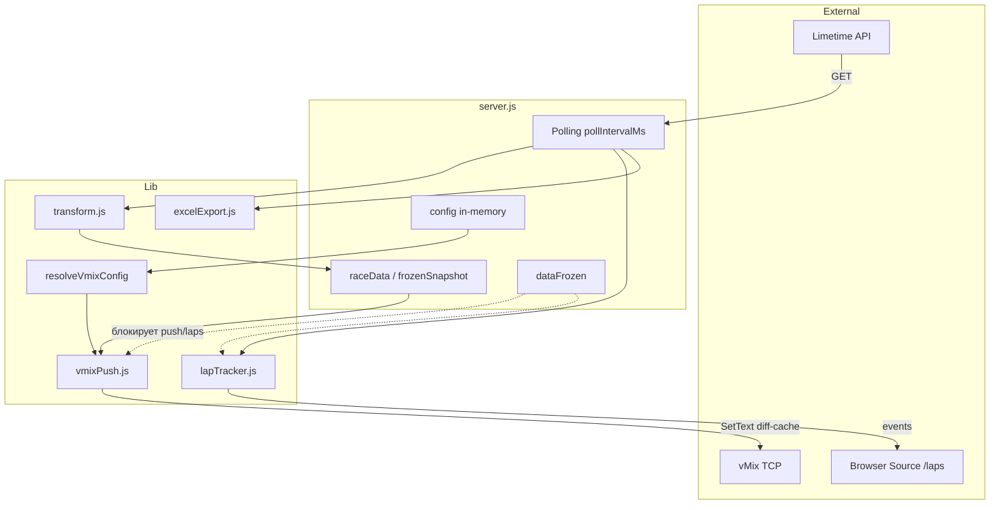

# Архитектура проекта

## Назначение

**VELO Limetime** — локальный сервис для судейской/трансляционной бригады на велогонках с учётом Limetime (racetime.online). Он:

1. Периодически загружает результаты по API для всех категорий активного события.
2. Преобразует сырые данные в таблицы (старт, live, финал, лидеры).
3. Отправляет данные в **vMix** по TCP (`SetText`, `OverlayInput1`) — **6 страниц по 10 строк**.
4. Показывает **плашки отсечек** в Browser Source `/laps` при прохождении круга.
5. Экспортирует **Excel** (`exports/data.xlsx`) — при включённом `excelExportEnabled`.

Оператор управляет через веб-панель; конфиг vMix, laps и Excel можно менять **на лету** через API/UI.

---

## Структура репозитория

```
velo/
├── server.js
├── config.json
├── lib/
│   ├── limetime.js
│   ├── transform.js
│   ├── lapTracker.js
│   ├── vmixConfig.js       # resolveVmixConfig, formatLapText
│   ├── vmixPush.js         # payload, diff-кэш, TCP
│   ├── vmixPlaques.js      # модель UI «Маппинг полей»
│   ├── vmixTemplates.js    # модель UI «vMix шаблоны»
│   ├── fieldMapping.js     # resolveAthleteValue
│   ├── excelExport.js
│   ├── configEditor.js
│   ├── setupRoutes.js
│   └── parseLimetimeUrl.js
├── public/
│   ├── index.html + js/app.js
│   ├── config.html + js/config.js
│   ├── laps.html + js/laps.js + css/laps.css
│   └── css/main.css
└── exports/data.xlsx
```

---

## Компоненты верхнего уровня



---

## Жизненный цикл сервера

При старте:

1. Загружает `config.json` в память (`config`).
2. TCP к vMix (`ConnectionTCP`, `config.vmix.host`).
3. `syncLapTrackerFromConfig()` — `totalLaps` из категорий.
4. Первый `refreshData()`, затем `setInterval(refreshData, pollIntervalMs)`.
5. HTTP на `PORT` (3000).

### Цикл опроса (`refreshData`)

```
┌──────────────────────────────────────────────────────────────────┐
│  refreshData() — mutex isFetching                                │
├──────────────────────────────────────────────────────────────────┤
│  1. Параллельно для каждой категории события:                    │
│       fetchResults → transformResults → categoryResults Map      │
│  2. Активная категория → raceData (+ lastUpdated)                │
│  3. pushResultsToVmix(getDisplayData())                          │
│       → buildVmixPayload → sendPayloadWithCache (diff SetText)   │
│  4. Если не frozen: lapTracker.processRawAthletes (все катег.)   │
│       → plaqueEvents → broadcast (SSE) / recent API              │
│  5. Если excelExportEnabled: saveExcel → data.xlsx               │
└──────────────────────────────────────────────────────────────────┘
```

**Активная категория** (`config.activeCategoryId`):

- таблица и страницы vMix на главной;
- авто-push results/leaders/lap counter;
- стартлист активной категории в vMix;
- плашки и lapState для `/laps`.

Все категории участвуют в Excel (лист на категорию); лист «Эфир» — только активная.

---

## transform.js

Вход: массив сырых участников Limetime. Выход:

| Поле | Описание |
|------|----------|
| `mode` | `start` \| `live` \| `final` |
| `startList`, `liveList`, `finalList`, `displayList`, `resultsList` | Таблицы |
| `leaders` | Топ-3 |
| `lapDetails` | Все завершённые круги (для replay) |
| `rawCount` | Число участников |

Строка таблицы: `место`, `участник`, `номер`, `возраст`, `клуб`, `результат`, `доЛидера`.  
Поле `raw` сохраняет сырой объект для `fieldMapping` (dot-пути Limetime).

---

## lapTracker.js

### Счётчик круга (N/M)

- **N** (`currentLap`) — текущий круг; растёт, когда **лидер** завершает новый круг.
- **M** (`totalLaps`) — из `categories[].totalLaps` или `POST /api/laps/total-laps`.
- Метка: `КРУГ N/M` или `КРУГ 1` до первого круга лидера.
- В vMix: `formatLapText()` → поле `lap` (`singleFields.lap` → `lap.Text`).

### Плашки отсечек

На каждом poll для каждого участника проверяются завершённые круги (`isOnLap && totalTime`). Новые круги (не в `seenPlaques`) → событие для `/laps`.

**Режим** `config.laps.mode` (`getLapsMode()`):

| mode | Поле `gap` на плашке |
|------|---------------------|
| `leader` | Лидер: `totalTime` или `00:00`; остальные: `leaderDifference` с `+` или `00:00` |
| `all` | У всех: `totalTime` или `00:00` |

Смена N/M по лидеру — **одинакова** в обоих режимах (`updateLeaderCounter`).

Первый poll категории — инициализация без плашек (`initialized`).

### Клиент `/laps`

Polling `GET /api/laps/recent` (~1 с). В режиме `leader` плашка лидера закреплена в `#plaque-leader-slot`; остальные — в общем стеке. В режиме `all` — класс `plaque-stack--all-mode`, единый скролл.

---

## Интеграция с vMix

### resolveVmixConfig (применение «на лету»)

`resolveVmixConfig(config)` вызывается **при каждой** сборке payload (`buildVmixPayload`, manual page, preview). Читает актуальный in-memory `config.vmix`, мержит с `DEFAULT_VMIX` из `vmixConfig.js`. После `saveConfig()` через API изменения видны на следующем push без рестарта Node.

Исключение: правка `config.json` на диске вручную требует рестарта (сервер не перечитывает файл автоматически).

### Схема страниц (6×10)

| Шаблон config | Подстановка | Назначение |
|---------------|-------------|------------|
| `resultsPage` | `results{page}` | Результаты, страницы 1–6 |
| `startlistPage` | `startlist{page}` | Стартлист (дефолт) |
| `startlistByCategory[id]` | per category | Переопределение шаблона стартлиста |
| `resultManual` / `startlistManual` | `{page}` | Ручной клик в UI |
| `winner1`…`winner3` | — | Персональные лидеры |
| `winners` | — | Тройной титр |
| `lapCounter` | — | Счётчик «КРУГ N/M» |

Дефолт `lapCounter` в коде: **`timer`**. В текущем `config.json` может быть другое имя (например `time`).

### indexedFields и singleFields

**indexedFields** — шаблон SelectedName с `{n}` (1…pageSize):

```
num  → "num {n}.Text"
name → "name {n}.Text"
...
```

**singleFields** — одно поле на Input:

```
class → "class.Text"
lap   → "lap.Text"
name 1 → "name 1.Text"
```

**startlistFields:** `num`, `name`, `age`, `city`  
**resultsFields:** `place`, `num`, `name`, `age`, `city`, `result`, `gap`

### fieldMapping

`resolveAthleteValue(athlete, fieldKey, fieldMapping)`:

- Путь в Limetime: `number`, `account.lastName+account.firstName`, …
- Корень: `athlete.raw` или сам объект
- Без маппинга — fallback на русские ключи строки таблицы

Редактор: `vmixPlaques.js` → `GET/POST /api/vmix/field-mapping`.

### pushAll и diff-кэш

`createVmixPusher()` хранит `lastSentValues: Map<"Input|SelectedName", value>`.

- `setTextCmd` — если значение совпало с прошлым, команда **не** добавляется в batch.
- `OverlayInput1` и прочие функции — без кэша.
- `resetCache()` — при `POST /api/category` (смена categoryId), снятии заморозки, `POST /api/vmix/templates`.

`buildVmixPayload` собирает команды для: всех startlist-страниц активной категории, results pages, winners page, leader1–3, lap counter.

### Превью

`GET /api/vmix/preview` → `buildVmixPayload` + `groupPayloadByInput` → `{ inputs: { "results1": { "name 1.Text": "..." } } }` без TCP.

### Ручные команды

- `POST /row1` — страница результатов + стартлиста (manual templates).
- `POST /vmixCommand` — winner overlay + `OverlayInput1`.

---

## Excel

`saveExcel` при poll (если `config.excelExportEnabled !== false`):

- Лист на категорию — `displayList`.
- Лист «Эфир» — `lapStateToArray` активной категории.

`POST /export` — полный `refreshData()`; Excel пишется только если автосохранение включено (но poll всегда выполняется).

---

## Состояние и заморозка

| Переменная | Назначение |
|------------|------------|
| `config` | In-memory конфиг |
| `raceData` | Данные активной категории |
| `dataFrozen` / `frozenSnapshot` | Заморозка vMix и плашек |
| `lastCategoryResults` | Кэш для preview/push startlist |
| `lapTracker` | События и lapState per category |

При freeze: vMix получает snapshot; новые plaqueEvents не публикуются; poll и Excel (если enabled) продолжаются.

---

## Фронтенд

### Панель оператора (`/`)

Vue 3 (CDN), `public/js/app.js`.

- Poll UI: каждые 3 с `POST /sheet1` + `GET /api/config`.
- Вкладки: `results`, `winners`, `vmix`, `mapping`, `templates` — `localStorage` ключ `velo.operatorActiveTab`.
- Верхняя панель: две группы (управление / ссылки).
- Баннер на `mapping` и `templates` (`isConfigTab`).
- Модалка «Превью vMix» → `GET /api/vmix/preview`.

### Настройка (`/config`)

Vue-форма, `POST /api/setup` — событие и 4 категории, парсинг URL.

---

## Конфигурация (`config.json`)

```json
{
  "limetime": { "baseUrl", "apiKey", "origin", "referer" },
  "pollIntervalMs": 5000,
  "excelExportEnabled": false,
  "laps": { "mode": "leader" },
  "vmix": {
    "host", "autoUpdate", "pageSize", "maxPages",
    "templates", "indexedFields", "singleFields",
    "startlistFields", "resultsFields",
    "startlistByCategory", "fieldMapping", "legacy",
    "winnerNameFields", "leaderNameFields", "indexedSpacedFrom"
  },
  "activeEventId", "activeCategoryId",
  "events": [{
    "id", "name", "raceGuid",
    "categories": [{ "id", "name", "stageGuid", "categoryGuid", "totalLaps" }]
  }]
}
```

Четыре категории с фиксированными `id` в `configEditor.js`: `women`, `men`, `junior_women`, `junior_men`.

---

## Hot-reload конфига (без рестарта)

| Изменение | API / UI | Эффект |
|-----------|----------|--------|
| vMix templates/fields | `POST /api/vmix/templates` | Следующий push; resetCache |
| fieldMapping | `POST /api/vmix/field-mapping` | Следующий push |
| laps mode | `POST /api/laps/mode` | Новые plaqueEvents |
| totalLaps | `POST /api/laps/total-laps` | lapState, vMix lap text |
| excel toggle | `POST /api/excel-export` | Следующий poll |
| setup | `POST /api/setup` | saveConfig + refreshData |

---

## Ограничения

- Состояние in-memory — рестарт сбрасывает lapTracker (первый poll без плашек).
- vMix опционален — без TCP push пропускается.
- Excel EBUSY — предупреждение в консоль, сервер не падает.
- Legacy vMix: `lider`, `lider4` в `/vmixCommand`.

---

## Дальнейшее чтение

- [backend-modules.md](./backend-modules.md)
- [api-reference.md](./api-reference.md)
