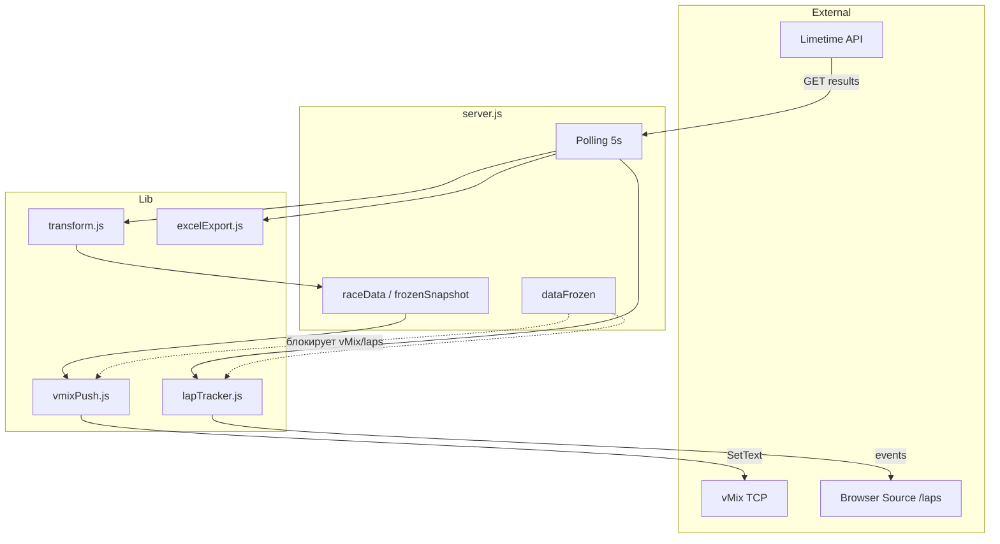
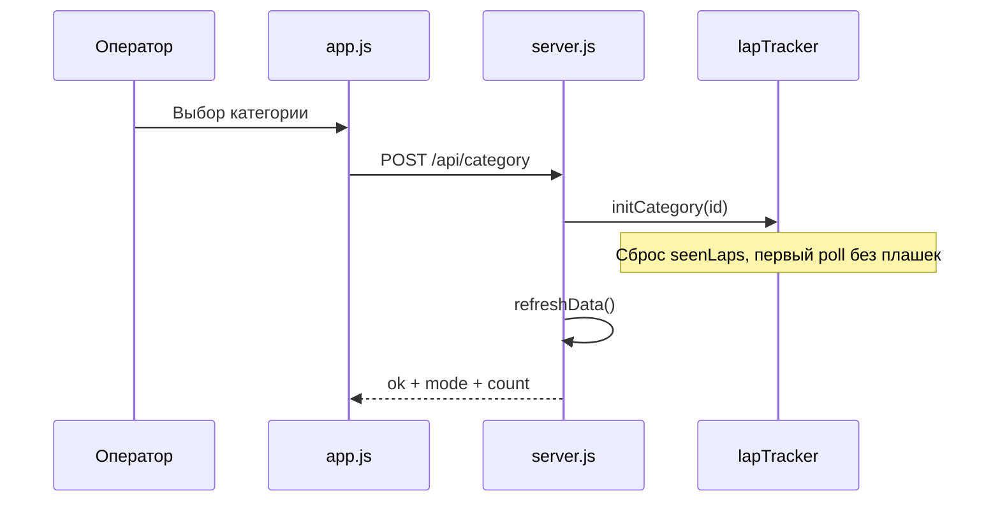

# Архитектура проекта

## Назначение

**velo-limetime** — локальный сервис для судейской/трансляционной бригады на велогонках с системой учёта Limetime (racetime.online). Он:

1. Периодически загружает результаты по API Limetime для всех категорий активного события.
2. Преобразует сырые данные в таблицы (стартовый лист, промежуточные, финал, лидеры).
3. Отправляет данные в **vMix** по TCP (текстовые поля шаблонов).
4. Показывает **плашки кругов** в Browser Source vMix при завершении круга участником.
5. Экспортирует сводный **Excel** (`exports/data.xlsx`) — лист на каждую категорию.

Оператор управляет всем через веб-панель; vMix и оверлей `/laps` работают как потребители данных сервера.

---

## Структура репозитория

```
velo/
├── server.js              # Точка входа: Express, polling, маршруты, состояние
├── config.json            # Конфигурация Limetime, vMix, событий
├── package.json
├── lib/
│   ├── limetime.js        # HTTP-клиент Limetime API
│   ├── transform.js       # Преобразование сырых данных в таблицы
│   ├── lapTracker.js      # Детекция новых кругов, очередь событий
│   ├── vmixConfig.js      # Дефолты и resolve конфига vMix
│   ├── vmixPush.js        # Отправка данных в vMix (SetText, OverlayInput)
│   ├── excelExport.js     # Запись data.xlsx
│   ├── configEditor.js    # Валидация и сохранение настроек события
│   ├── setupRoutes.js     # Роуты /api/setup*
│   └── parseLimetimeUrl.js # Парсинг URL → raceGuid/stageGuid/categoryGuid
├── public/
│   ├── index.html + js/app.js    # Панель оператора (Vue 3)
│   ├── config.html + js/config.js # Настройка категорий
│   ├── laps.html + js/laps.js + css/laps.css  # Оверлей плашек
│   └── ...
└── exports/
    └── data.xlsx          # Генерируется автоматически при каждом poll
```

---

## Компоненты верхнего уровня



---

## Жизненный цикл сервера

При старте `server.js`:

1. Загружает `config.json`.
2. Создаёт TCP-соединение с vMix (`ConnectionTCP` из `node-vmix`).
3. Инициализирует `lapTracker` и `vmixPusher`.
4. Выполняет первый `refreshData()`.
5. Запускает `setInterval(refreshData, pollIntervalMs)` (по умолчанию 5000 мс).
6. Слушает HTTP на порту 3000.

### Цикл опроса (`refreshData`)

```
┌─────────────────────────────────────────────────────────────┐
│  refreshData() — не более одного одновременного вызова      │
├─────────────────────────────────────────────────────────────┤
│  1. Для каждой категории активного события — параллельно:   │
│     fetchResults → transformResults                         │
│  2. Активная категория → обновить raceData                  │
│  3. pushResultsToVmix(getDisplayData())                     │
│  4. lapTracker.processRawAthletes (если не frozen)          │
│  5. saveExcel — все категории в data.xlsx                   │
└─────────────────────────────────────────────────────────────┘
```

**Активная категория** (`config.activeCategoryId`) определяет:
- что показывается на главной панели;
- какие данные уходят в vMix при автообновлении;
- для какой категории отслеживаются новые круги.

Все 4 категории всё равно опрашиваются — это нужно для Excel и быстрого переключения категории без «холодного» старта.

---

## Модель данных после трансформации

Модуль `transform.js` возвращает объект:

| Поле | Описание |
|------|----------|
| `mode` | `start` \| `live` \| `final` — фаза гонки |
| `columns` | Заголовки колонок (7 полей на русском) |
| `startList` | Стартовый лист (участники с `isOnStart`, по номеру) |
| `liveList` | Промежуточные результаты |
| `finalList` | Финальные результаты |
| `displayList` | То, что показывает UI: startList или resultsList |
| `resultsList` | Общий список результатов (ранжированные) |
| `leaders` | Топ-3 лидера |
| `lapDetails` | Все завершённые круги всех участников |
| `rawCount` | Число участников в сыром ответе |

### Определение режима (`detectMode`)

| Условие | mode |
|---------|------|
| Нет участников | `start` |
| Все `isFinished` | `final` |
| Есть хотя бы один с `position` | `live` |
| Иначе | `start` |

### Строка таблицы

Каждая строка — объект с ключами:

`место`, `участник`, `номер`, `возраст`, `клуб`, `результат`, `доЛидера`

---

## Состояние сервера

Глобальные переменные в `server.js`:

| Переменная | Назначение |
|------------|------------|
| `config` | Текущий конфиг (перечитывается при save) |
| `raceData` | Данные активной категории после последнего poll |
| `dataFrozen` | Флаг заморозки |
| `frozenSnapshot` | Копия `raceData` на момент заморозки |
| `vmixConnected` | Статус TCP к vMix |
| `lapTracker` | Singleton трекера кругов |
| `sseClients` | Клиенты SSE (legacy, `/api/laps/stream`) |

### Заморозка данных (`dataFrozen`)

При `POST /api/freeze { frozen: true }`:

- Сохраняется `frozenSnapshot = clone(raceData)`.
- vMix получает данные из снимка, а не из live poll.
- Новые события кругов **не** публикуются (`lapTracker`, SSE, simulate, replay блокируются).
- **Poll Limetime и Excel продолжают работать** — оператор видит live-данные в `liveMode`, но вывод «заморожен».

При разморозке vMix снова получает актуальный `raceData`.

---

## Интеграция с vMix

### Подключение

TCP к `config.vmix.host` (по умолчанию `localhost`). Команды через `node-vmix`: `SetText`, `OverlayInput1`.

### Автообновление (`vmixPush.pushAll`)

При каждом успешном poll (если `autoUpdate !== false` и vMix подключён):

1. **Стартовые листы** — шаблоны `startlist{page}` (до `maxPages × pageSize` строк).
2. **Результаты** — шаблоны `res{page}`; при `mode === 'final'` берётся `finalList`, иначе `liveList`.
3. **Персональные победители** — `winner1`, `winner2`, `winner3` (по одной строке).
4. **Тройка** — шаблон `winners` (3 строки).

Пустые слоты **очищаются** (отправляются пустые строки), чтобы в vMix не оставались старые ФИО.

### Ручные команды

`POST /vmixCommand` с `data`: `winner1`, `winner2`, `winner3`, `winners` (и legacy `lider`, `lider4`).

Заполняет соответствующий шаблон и вызывает `OverlayInput1` — показывает оверлей в vMix.

### Ручная страница

`POST /row1` — оператор кликает страницу в UI; сервер заполняет шаблоны `result` и `startlist` (manual) для выбранной десятки участников.

### Маппинг полей

В `config.json` → `vmix.fields` задаются имена текстовых полей GT Title в шаблонах vMix, например:

```
place {row}.Text  →  place 1.Text, place 2.Text, ...
```

Подробнее — [backend-modules.md](./backend-modules.md#vmixconfigjs--vmixpushjs).

---

## Оверлей плашек кругов (`/laps`)

Отдельная HTML-страница для Browser Source vMix (1920×1080, прозрачный фон).

### Источник событий

Клиент **опрашивает** `GET /api/laps/recent?categoryId=...` каждую 1 с (не SSE — надёжнее в vMix Browser).

Сервер при poll сравнивает завершённые круги (`isOnLap && totalTime`) с уже виденными; **первый poll молчит** (инициализация без лавины плашек).

### Событие круга

```json
{
  "id": "men-42:3:1:23:45-abc123",
  "place": "3",
  "number": "42",
  "name": "ИВАН ИВАНОВ",
  "gap": "+1:12",
  "lapNumber": "3",
  "at": "2026-07-31T19:00:00.000Z",
  "categoryId": "men"
}
```

### Клиентская логика (`laps.js`)

- До **4 плашек** на экране; новая — снизу, старые сдвигаются вверх с анимацией.
- Очередь событий + защита от дублей по `id`.
- Fallback по таймеру, если `transitionend` не сработал (важно для vMix).
- Режимы: `?demo=1` (карусель), `?test=1` (ручной ввод), URL-параметры для позиции/размеров (CSS-переменные).

---

## Фронтенд

### Панель оператора (`/`)

Vue 3 без сборки (CDN). Каждые 3 с:

1. `POST /sheet1` — таблица `displayList` (или frozen).
2. `GET /api/config` — метаданные, режим, ошибки, экспорт.

Функции: смена категории, WINNER 1/2/3/WINNERS, заморозка, ручной выбор страницы для vMix, ссылки на `/laps`.

### Настройка (`/config`)

Форма для 4 категорий: вставка URL Limetime → парсинг GUID → сохранение в `config.json` → перезапуск polling.

---

## Конфигурация (`config.json`)

```json
{
  "limetime": {
    "baseUrl": "https://services-results.limetime.io/results/get",
    "apiKey": "...",
    "origin": "https://racetime.online",
    "referer": "https://racetime.online/"
  },
  "pollIntervalMs": 5000,
  "vmix": { "host", "autoUpdate", "pageSize", "maxPages", "templates", "fields", "legacy" },
  "activeEventId": "...",
  "activeCategoryId": "...",
  "events": [
    {
      "id", "name", "raceGuid",
      "categories": [{ "id", "name", "stageGuid", "categoryGuid" }]
    }
  ]
}
```

### Событие и категории

- Одно событие содержит ровно **4 категории** (женщины, мужчины, юниорки, юниоры — ID фиксированы в `configEditor.js`).
- Все URL категорий должны иметь один `raceGuid`.
- GUID извлекаются из пути `/results/get/{race}/{stage}/{category}`.

---

## Зависимости

| Пакет | Роль |
|-------|------|
| `express` | HTTP-сервер, static, JSON body |
| `axios` | Запросы к Limetime |
| `node-vmix` | TCP API vMix |
| `exceljs` | Запись `.xlsx` |

---

## Ограничения и особенности

- **Один процесс** — состояние in-memory; перезапуск сбрасывает lapTracker (первый poll снова без плашек).
- **vMix опционален** — без подключения авто-push просто пропускается; ошибки TCP не роняют сервер.
- **Excel EBUSY** — если файл открыт в Excel, запись логируется как предупреждение.
- **Leaders limit 3** — для vMix и UI; в `transform.js` функция `buildLeaders` по умолчанию принимает limit, в `transformResults` передаётся 3.
- **Legacy команды vMix** — `lider` → winner1, `lider4` → winners (обратная совместимость).

---

## Диаграмма: переключение категории



---

## Дальнейшее чтение

- [backend-modules.md](./backend-modules.md) — детали каждого модуля `lib/`
- [api-reference.md](./api-reference.md) — полный список HTTP-эндпоинтов
